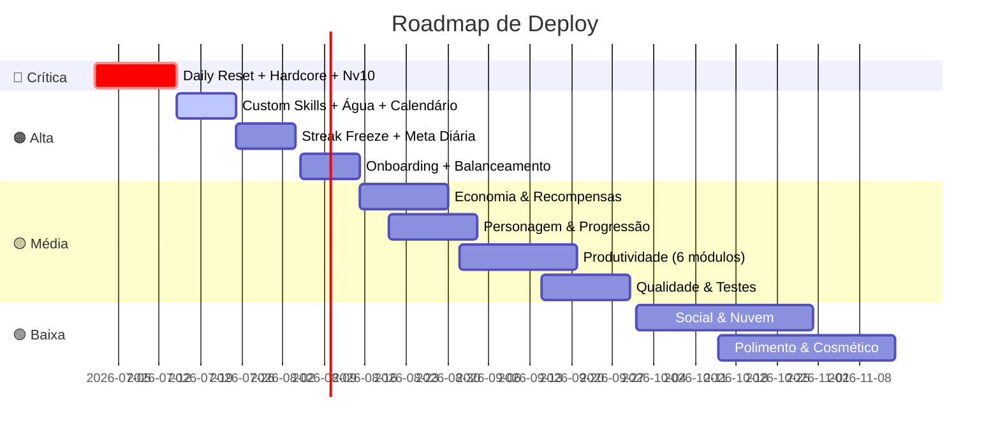

# Plano de Deploy — Issues por Nível de Criticidade

> Organização do backlog do ZÊNITE/FARM para execução progressiva, priorizando o que entrega mais valor com menor dependência.

---

## Como usar este plano

Cada tier é um "deploy" — um ciclo de desenvolvimento que produz uma versão estável e testável. Siga a ordem numérica. Dentro de cada tier, as issues estão ordenadas por dependência (faça de cima para baixo).

**Legenda:** `E1a` = Épico 1, sub-issue `a`. Consulte `create-issues.sh` para o corpo completo de cada issue.

---

## 🔴 TIER 0 — Crítica (corrigir ANTES de qualquer feature nova)

> Bugs, riscos de perda de dados e loops quebrados. Essas issues afetam a **integridade** do app. Nada deve ser construído sobre uma base instável.

| # | Issue | Épico | Risco se não fizer |
|---|-------|-------|--------------------|
| 1 | **Daily Reset robusto** (fuso horário, virada de dia) — `E1d` | 1 | Streak corrompido, diárias não resetam, dano errado. **Perda de dados.** |
| 2 | **Modo Hardcore completo** (game over + reviver com moedas) — `E1c` | 1 | HP chega a 0 sem consequência — o ciclo punição/recuperação não fecha. Jogadores hardcore ignoram HP. |
| 3 | **Curva de XP além do nível 10** (progressão contínua) — `E1a` | 1 | Jogador "zera" o jogo no nível 10. Sem progressão de longo prazo, abandona. |

**Esforço estimado total:** ~3-5 dias

**Critério de aceite:** app roda 7 dias consecutivos sem perda de streak, dano é aplicado corretamente, e é possível subir além do nível 10.

---

## 🟠 TIER 1 — Alta (essencial para retenção e usabilidade)

> Features que o usuário sente falta **no primeiro uso** ou que são diferenciais competitivos diretos. Também inclui o que já tem CSS/suporte no modelo mas falta UI.

### Lote 1A — O que já tem estrutura esperando (`README #1, #2, #3`)

| # | Issue | Épico | Por que é alta |
|---|-------|-------|----------------|
| 4 | **UI de Custom Skills** (criar/editar) — `E4a` | 4 | `player.customSkills` já existe no modelo. Sem UI o recurso é invisível. |
| 5 | **Água/Hidratação** (8 copos + meta) — `E6a` | 6 | CSS `.water-btns` já existe. Feature de produtividade mais simples de implementar. |
| 6 | **Calendário de produtividade** (semana/mês) — `E3e` | 3 | CSS `.cal` já existe. Dá visibilidade temporal que o app não tem. |

### Lote 1B — Engajamento (retenção)

| # | Issue | Épico | Impacto |
|---|-------|-------|---------|
| 7 | **Meta diária de XP configurável** — `E2b` | 2 | Duolingo: anel de progresso diário é o maior motor de retenção. |
| 8 | **Streak Freeze** (proteção de ofensiva) — `E2a` | 2 | Duolingo: +48% de duração da ofensiva. Loss aversion sem burnout. |

### Lote 1C — Qualidade de vida

| # | Issue | Épico | Por que |
|---|-------|-------|---------|
| 9 | **Onboarding gamificado** (criar herói + 1ª missão) — `E7c` | 7 | Primeira impressão. Sem onboarding, usuário abre e não sabe o que fazer. |
| 10 | **Balanceamento anti-abuso** (economia) — `E5e` | 5 | Evitar inflação que quebra a motivação. Deve vir antes de expandir a economia. |
| 11 | **Três tipos de tarefa** (Hábitos +/−, Diárias, To-Dos) — `E3a` | 3 | Reestrutura o sistema de tarefas. Tem impacto em várias views. |
| 12 | **Missões com intervalo de datas** (começa em + prazo) — `E3b` | 3 | Bug: missão com prazo futuro não aparece até o dia limite. |

**Esforço estimado total:** ~8-12 dias

**Critério de aceite:** novo usuário completa onboarding, entende o loop, e tem metas diárias claras. Streak não morre com 1 dia perdido.

---

## 🟡 TIER 2 — Média (expansão de features)

> Features importantes que aprofundam a experiência, mas não bloqueiam o uso diário. Podem ser entregues em qualquer ordem.

### Lote 2A — Economia & Recompensa (Octalysis Drive 7)

| # | Issue | Épico | Depende de |
|---|-------|-------|------------|
| 13 | **Recompensa variável / Loot box** ao concluir missões — `E1b` | 1 | Balanceamento (Tier 1C) |
| 14 | **Loja de recompensas personalizadas** (CRUD próprio) — `E5a` | 5 | — |
| 15 | **Poções e itens utilitários** (cura, x2 XP, freeze) — `E5d` | 5 | Streak Freeze (Tier 1B) |
| 16 | **Loot boxes / baús com raridade** — `E5b` | 5 | Loot box básica (#13) |

### Lote 2B — Personagem & Progressão

| # | Issue | Épico | Depende de |
|---|-------|-------|------------|
| 17 | **Atributos que sobem por categoria** — `E4b` | 4 | Custom Skills UI (Tier 1A) |
| 18 | **Avatar com gear desbloqueável** — `E4c` | 4 | — |
| 19 | **Subtarefas / checklists** dentro de missões — `E3f` | 3 | — |

### Lote 2C — Competição & Social local

| # | Issue | Épico |
|---|-------|-------|
| 20 | **Combos & bônus de momentum** (multiplicador de XP) — `E2e` | 2 |
| 21 | **Ligas / Leaderboard semanal** (local com bots) — `E2c` | 2 |
| 22 | **Notificações PWA** (lembrete diário) — `E2f` | 2 |

### Lote 2D — Módulos de Produtividade restantes

| # | Issue | Épico | Observação |
|---|-------|-------|------------|
| 23 | **Finanças com gráficos** — `E6b` | 6 | README #5 |
| 24 | **Academia com histórico** — `E6c` | 6 | README #6 |
| 25 | **Estudos com Pomodoro integrado** — `E6d` | 6 | README #7 |
| 26 | **Caverna/Foco estilo Forest** (bloqueio + árvore) — `E6e` | 6 | |
| 27 | **Notas com categorias + Markdown** — `E6f` | 6 | README #8 |
| 28 | **Mídia com filtros avançados** — `E6g` | 6 | README #9 |

### Lote 2E — Qualidade & Arquitetura

| # | Issue | Épico |
|---|-------|-------|
| 29 | **Polir 'juice': animações de XP/moeda/level** — `E1e` | 1 |
| 30 | **Expandir conquistas (Recordes + Prêmios)** — `E7a` | 7 |
| 31 | **Tela de Estatísticas & Recordes** — `E7b` | 7 |
| 32 | **Acessibilidade (ARIA, foco, contraste)** — `E8a` | 8 |
| 33 | **Testes automatizados + CI** — `E8c` | 8 |
| 34 | **Refatorar app.js em módulos** — `E8d` | 8 |
| 35 | **Performance & PWA polish (Lighthouse)** — `E8e` | 8 |

**Esforço estimado total:** ~20-30 dias

**Critério de aceite:** economia rica (loja, loot, poções), personagem evolui visualmente, leaderboard local funciona, todos os módulos de produtividade operacionais, código modular com testes.

---

## 🟢 TIER 3 — Baixa (nice-to-have / futuro)

> Features legais mas não essenciais. A maioria depende de features de tiers anteriores ou de backend. Faça quando o core estiver sólido.

### Lote 3A — Social & Nuvem (depende de backend)

| # | Issue | Épico | Dependência crítica |
|---|-------|-------|--------------------|
| 36 | **Backend/API + Autenticação** — `E9a` | 9 | Nenhuma, mas é pré-requisito para todas abaixo |
| 37 | **Sincronização multi-dispositivo** — `E9b` | 9 | Backend (#36) |
| 38 | **Social: amigos, feed, friend streaks** — `E9c` | 9 | Backend (#36) |
| 39 | **Clãs / parties com boss compartilhado** — `E9d` | 9 | Backend (#36) |
| 40 | **Rankings globais / temporadas** — `E9e` | 9 | Backend (#36), Ligas (#21) |

### Lote 3B — Polimento & Cosmético

| # | Issue | Épico |
|---|-------|-------|
| 41 | **Boss Fights com lore e recompensa** — `E3c` | 3 |
| 42 | **Batalhas de mau hábito (Bad Guys) + Power-Ups** — `E3d` | 3 |
| 43 | **Mascote/Pet que evolui (modo fofo)** — `E4d` | 4 |
| 44 | **Títulos & Hall da Glória** — `E4e` | 4 |
| 45 | **Eventos sazonais / desafios limitados** — `E2d` | 2 |
| 46 | **Crafting / combinar itens** — `E5c` | 5 |

### Lote 3C — Configuração & Experiência

| # | Issue | Épico |
|---|-------|-------|
| 47 | **Modo Gentil / Self-care (sem punição)** — `E7d` | 7 |
| 48 | **Capas personalizáveis (GIF estilo Notion)** — `E7e` | 7 |
| 49 | **Sons/efeitos (Web Audio) + Modo noturno automático** — `E7f` | 7 |
| 50 | **Atalhos de teclado** — `E8b` | 8 |

**Esforço estimado total:** ~25-40 dias (grande parte dependente de backend)

**Critério de aceite:** app multiplayer funcional, economia com crafting, cosméticos e eventos sazonais, experiência completamente polishada.

---

## 📊 Resumo por Tier

| Tier | Nome | Issues | Esforço estimado | Entrega |
|------|------|--------|------------------|---------|
| 🔴 0 | Crítica | 3 | 3-5 dias | Estabilidade |
| 🟠 1 | Alta | 12 | 8-12 dias | Retenção |
| 🟡 2 | Média | 23 | 20-30 dias | Expansão |
| 🟢 3 | Baixa | 15 | 25-40 dias | Polimento/Social |
| | **Total** | **53** | **~56-87 dias** | |

---

## 📦 Estratégia de Deploy

Cada tier pode virar uma **release** numerada:

| Release | Tier | Versão sugerida | Entrega |
|---------|------|-----------------|---------|
| R1 | 🔴 Crítica | v1.1.0 | Estabilidade do core |
| R2 | 🟠 Alta | v1.2.0 | Retenção + usabilidade |
| R3 | 🟡 Média | v1.3.0 | Expansão completa |
| R4 | 🟢 Baixa | v2.0.0 | Social + polimento |

> **Nota:** Dentro de cada release, respeitar a ordem numérica das issues (cada uma pode depender da anterior). Issues sem dependências podem ser paralelizadas.

---

## ⚡ Recomendação de Ciclo

Para execução prática, sugiro ciclos **semanais**:

- **Semana 1-2:** TIER 0 (corrigir base)
- **Semana 3-4:** TIER 1A (o que já tem CSS/modelo)
- **Semana 5-6:** TIER 1B-1C (retenção + onboarding)
- **Semanas 7-12:** TIER 2 (expansão)
- **Semanas 13+:** TIER 3 (social e polish)

---

*Gerado a partir de `create-issues.sh` e `ANALISE-GAMIFICACAO.md`. Atualize este documento conforme o backlog evoluir.*
